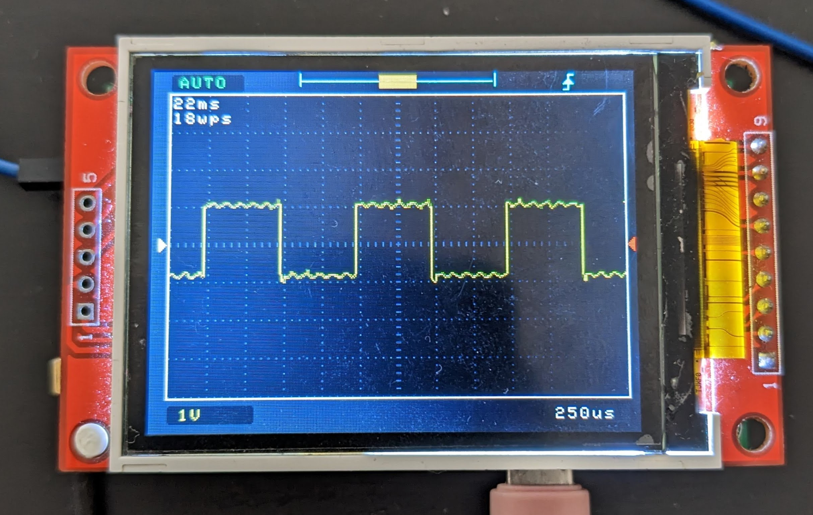
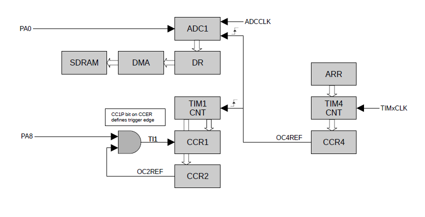
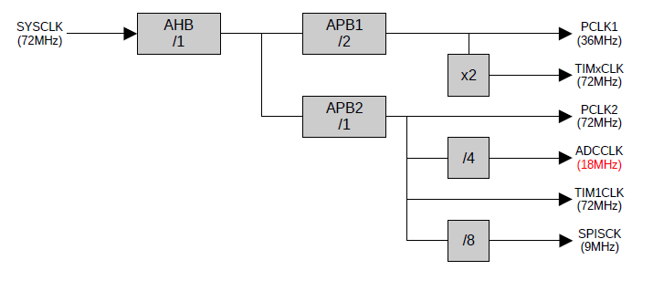

# Tiny Digital Sample Oscilloscope

## Specs 

- Samples/second: barely 2msps
- BW: 400Khz
- Max Input: 15V
- One channel
- External trigger
- 2.2" 320x240 TFT screen

## Hardware

- See doc folder

## Build

`make`

## Software

### layers
<pre>
+------------------------------------------+
|                   DSO                    |     
+------------------------------------------+
        |                        |
+----------------+     +-------------------+ 
|     Lib2d      |     |   Sample engine   |
+----------------+     +-------------------+ 
    |                       |         |
+--------+-------+     +---------+---------+ 
|  SPI   |  DMA  |     |  ADC    |   TIM   |
+--------+-------+     +---------+---------+
    |                       |         |
+----------------+     +-------------------+ 
|  TFT Display   |     |        AFE        |
+----------------+     +-------------------+ 
</pre>

### Sample engine

 
